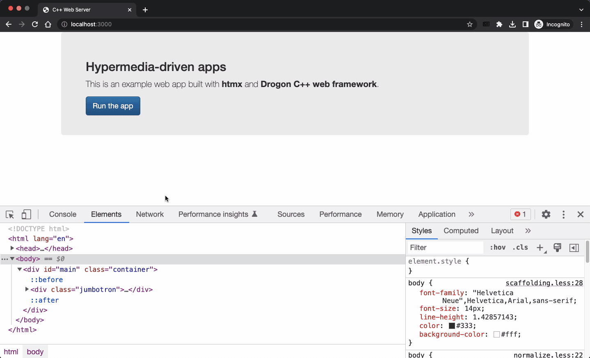
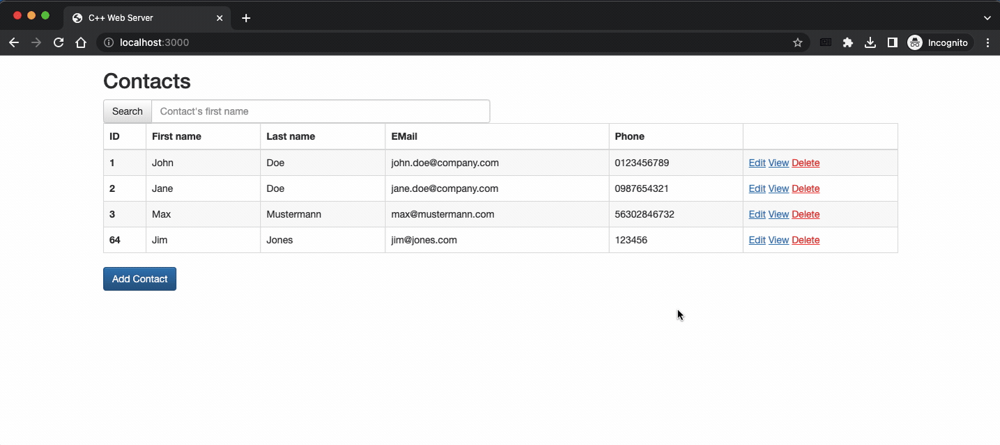
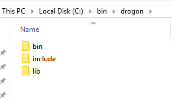
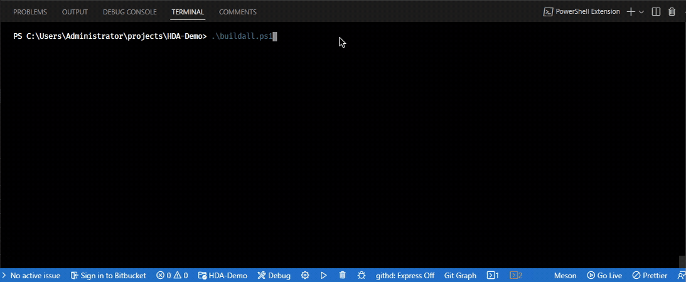
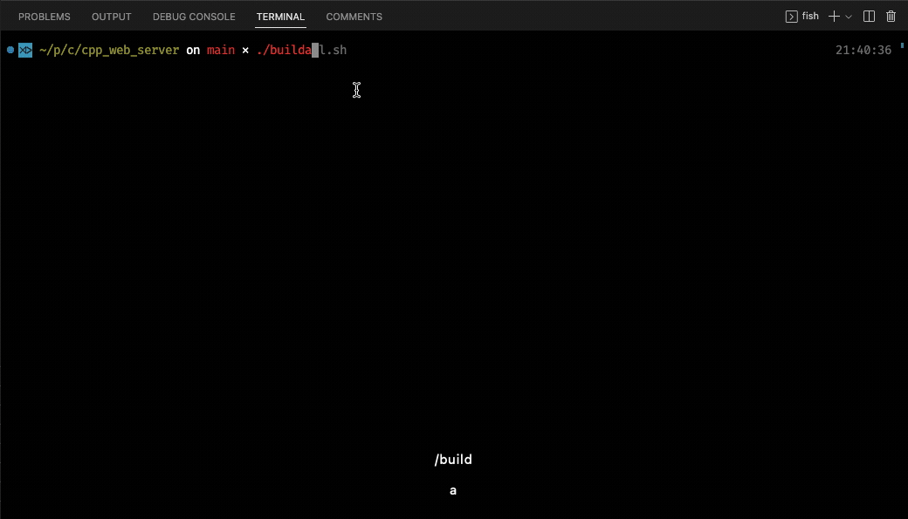
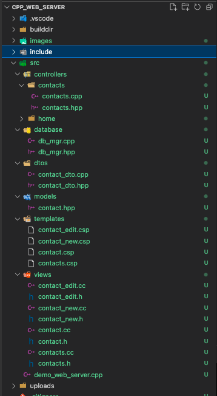
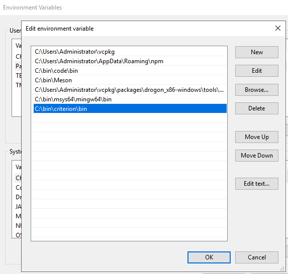
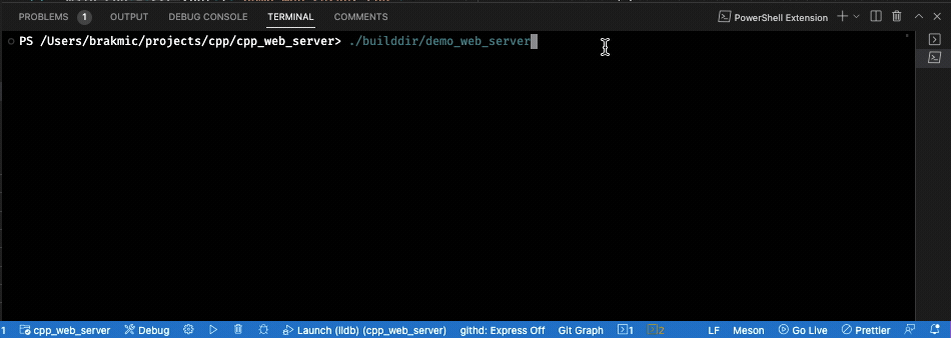

### Hypermedia-driven app built with **htmx** and **C++**



- [Introduction](#introduction)
  - [htmx](#htmx)
  - [\_hyperscript](#_hyperscript)
  - [Why C++ for the backend?](#why-c-for-the-backend)
- [Setup](#setup)
  - [MacOS, Linux](#macos-linux)
  - [Windows](#windows)
    - [MSYS](#msys)
    - [Build system](#build-system)
    - [Drogon](#drogon)
    - [Static libraries](#static-libraries)
  - [Meson](#meson)
- [Application architecture](#application-architecture)
- [Project structure](#project-structure)
- [Tests](#tests)
  - [macOS / Linux](#macos--linux)
  - [Windows](#windows-1)
- [Hypermedia-driven app](#hypermedia-driven-app)
  - [Program arguments](#program-arguments)
  - [Drogon configuration file](#drogon-configuration-file)
  - [Web Server configuration file](#web-server-configuration-file)
- [CHANGELOG](#changelog)
- [LICENSE](#license)

-----
## Introduction

This repository contains an [HDA](https://htmx.org/essays/hypermedia-driven-applications/) based on [htmx](https://htmx.org/) (frontend) and [Drogon C++ framework](https://drogon.org/) (backend). 

The aim was to create a responsive "web app" without using any of the usual JavaScript frameworks.

The idea for this project came while reading the excellent book [Hypermedia Systems](https://hypermedia.systems/). In it, the authors talk about alternative ways for writing `modern` web applications. Unlike most of the other books on web development, the authors don't rely on any JavaScript framework, but instead go back to the roots of the hypermedia architecture that is `the web` itself.
### htmx

Instead of using JavaScript *to overcome* HTML, a strategy that basically reproduces thick-clients of the 90es, the authors use `htmx` **to augment** it. They make it capable of doing *more* without falling back to clever JavaScript tricks. Of course, JS isn't forbidden and `htmx` itself relies on it for its own development, but JS is not visible as there is no actual need for it.

We don't need to use JS to replace seemingly "insufficient" hypermedia controls, because **htmx** is here to extend them. It makes them capable of doing 
*more* as originally defined. An anchor tag (`<a>`), for example, can be "upgraded" so that it can execute POST, PUT, PATCH, or even DELETE requests. A `<form>` tag doesn't have to be the only hypermedia control for sending data via POST requests. How about writing your own controls that can do exactly the same? Or maybe `<form>`s that can PATCH existing entries on the server? What usually demands explicit JS code can now be done *declaratively* with *upgraded* hypermedia controls.

Here's an example from this project. Two buttons (*Cancel* & *Save*) which can be found in almost every sufficiently complex web app.

```html
<button hx-get="/contacts"
        hx-target="#main"
        hx-swap="innerHTML">
        Cancel
</button>
<button hx-post="/contacts//edit"
        hx-include="input"
        hx-target="#main"
        hx-swap="innerHTML">
        Save
</button>
```

Believe it or not, but these two utilize the following functionalities:

* Executing AJAX requests.
* Using HTTP verbs that are usually not available for `<button>` controls.
* Passing of additional element values in AJAX requests.
* Transclusion (that is, *where* and *how* to insert the server response data)

And not a single line of JavaScript was needed to make it work. This is how powerful hypermedia architecture actually is.

### _hyperscript

We also use [_hyperscript](https://hyperscript.org/), a small library for event handling and DOM manipulation. With it, we can listen to and dispatch events, manipulate DOM objects, all without leaving HTML.

Here's an example from this project:

```html
<button id="edit-c" class="btn btn-primary"
      hx-get="/contacts//edit"
      hx-target="#main"
      hx-swap="innerHTML">Edit</button>
<button class="btn btn-danger"
      hx-delete="/contacts//delete"
      hx-confirm="Are you sure you wish to delete this contact?"
      hx-target="this"
      hx-swap="none"
      _="on click remove #edit-c
                  then remove me"
      >Delete</button>
<button class="btn btn-info"
      hx-get="/contacts"
      hx-target="#main"
      hx-swap="innerHTML">Back</button>
```

In the second `<button>` control we have a few bits of _hyperscript that does the following:

* reacts to click events
* then removes the control with *id=edit-c*
* then removes the button that reacted to click event (it removes itself)

The final result is the removal of the buttons `Edit` and `Delete`. Only the button `Back` remains.



-----

Instead of sending JSONs back and forth (*and each time parsing them according to some internal logic*), we can use HTML as originally designed: as a vehicle for meaningful hypermedia applications. The HTTP protocol exists because of HTML, but these days we mostly transfer JSON over it. This actually makes little sense, because JSON can't transport application semantics, which effectively cripples the original meaning of the *client-server archiecture* of the web. No wonder we need massive JS frameworks on our frontends, because our servers are mostly just data providers with JSON APIs. And JSON APIs aren't "RESTful".

-----

### Why C++ for the backend?

The book's example backend source code is written in Python and it can be used instead of C++. In fact, I have tried to mimic the original Python APIs, so that there should be no big gaps in understanding them both. I was writing the C++ code while reading the respective chapters.

But as `htmx` is very language agnostic, there is no problem of using any language whatsoever, so I used C++. This is also good from the learning perspective as it forces me to double check everything.

I think that we should remove bloat not only from our frontends [*put any massive JS framework in here*], but also from our backends [*put any massive backend framework in here*]. Massive software consumes massive amounts of time and energy. **Human** time and energy as well as **CPU** cycles and electricity.

## Setup

### MacOS, Linux
  
A few C++ libraries are needed for the compilation to succeed. This project uses [vcpkg](https://vcpkg.io/en/index.html) as its package manager, but you are free to choose any other instead.

To install a package, simply invoke `vcpkg install PACKAGE_NAME`.

The following packages are needed:

    drogon
    drogon[ctl]
    fmt
    argparse
    brotli
    zlib
    openssl
    sqlite3
    soci[core]
    soci[sqlite3]

The search for them is easy: `vcpkg search PACKAGE_NAME`


### Windows

#### MSYS

Windows users will have to setup [MSYS](https://www.msys2.org/) environment first. After the installation, select the `MSYS2 MINGW64` entry in the Windows Start Menu. **Do not use the `MSYS UCRT4` or any other entry!**

#### Build system

In the newly opened bash window, enter this command to install the required packages:

`pacman -S git mingw-w64-x86_64-gcc mingw-w64-x86_64-cmake make mingw-w64-x86_64-c-ares mingw-w64-x86_64-jsoncpp mingw-w64-x86_64-openssl`

Check if the compiler is available with `which g++`. You should see a message like this:

```shell
$ which g++
/mingw64/bin/g++
```

You will also need an editor to update the environment paths, so install your preferred one, e.g. `pacman -Sy nano` or `pacman -Sy vim`

Open your `.bash_profile` with `nano .$HOME/.bash_profile` and add these three lines to the end of the file:


```bash
PATH=/mingw64/bin:$PATH
export VCPKG_DEFAULT_TRIPLET=x64-mingw-static
export VCPKG_DEFAULT_HOST_TRIPLET=x64-mingw-static
```

Save & close the file. Reload it with: `source $HOME/.bash_profile` or `. ~/.bash_profile`

The two triplet entries will be needed later to instruct `vcpkg` to use MinGW instead of the default Visual C++ compiler. And as we also want to compile static libraries only, we announce it by using the `static` suffix.

#### Drogon

Unlike other packages, Drogon will not be installed with `vcpkg`. The currently available vcpkg package thows compilation errors, which is the reason why we have to compile it manually.

Clone the Drogon sources and prepare the build environment. The `/c/bin/drogon` path from the example below should be adapted to your local settings. The root of this path (`/c/bin`) must map to an already existing path in the Windows system, e.g. `C:/bin` or any other path of your choosing.

```bash
git clone https://github.com/drogonframework/drogon --recursive
mkdir drogon/build
cd drogon/build
cmake .. -G "MSYS Makefiles" -DCMAKE_INSTALL_PREFIX:PATH=/c/bin/drogon
```

Now compile Drogon with `make -j` and wait until it completes. 

Finally, install Drogon with `make install`.

You should now see a list of folders in `C:/bin/drogon`.



#### Static libraries

The second step is the installation of a few libraries that will be linked statically. We will use `vcpkg` to compile them all.

From the same bash window, issue the following commands to setup `vcpkg`. 

```bash
cd $HOME
git clone https://github.com/microsoft/vcpkg.git
cd vcpkg
./bootstrap-vcpkg.bat
```

*Notice:* 
    
    If you pefer to install vcpkg files under different root path, change the first command "cd $HOME" from the script above. 

    For example: cd /c/Users/WINDOWS_USER_NAME

    In MSYS Bash, the Windows file system is located under /c.
    And your MSYS $HOME folder is located under "home" in your Windows MSYS root folder.

From the `vcpkg` folder, issue the following commands to install required libraries:

```bash
./vcpkg.exe install argparse
./vcpkg.exe install fmt
./vcpkg.exe install brotli
./vcpkg.exe install zlib
./vcpkg.exe install openssl
./vcpkg.exe install sqlite3
./vcpkg.exe install soci
./vcpkg.exe install soci[sqlite3]
```

Now you can compile this project via PoweShell with `./buildall.ps1`.

But, don't forget to change `vcpkg_root` in `meson.build` first. This path should point at the previously cloned `vcpkg` repository.



### Meson

My build system of choice is [Meson](https://mesonbuild.com/), because `Makefiles` are hard to maintain and I simply don't want to learn how to use `CMake`. Life is too short for user-hostile software.

There are two scripts, `buildall.sh` (macOS/Linux) and `buildall.ps1` (Windows). With these two the following steps will be executed:

* Copy web files (index.html, styles etc.) to `builddir` (*only on Windows, in macOS/Linux this will be done by Meson*)
* Initialize and run Meson:
   * use `drogon_ctl` to convert CSPs into C++ source files and put them into `src/views`
   * compile sources from `src`
   * put the output binary into `builddir`

A C++20 compiler is needed. I'm using GNU C++ v12.1.0.

Before trying to build the project, please, adapt these two variables in the `meson.build` file:

* [triplet](meson.build#L26)
* [vcpkg_root](meson.build#L34)

The `triplet` carries the information about the host machine, e.g. `x64-osx`.

The `vcpkg_root` is the root folder containing packages installed by `vcpkg`.

`drogon_ctl` will be used by `Meson` to convert CSP templates into C++ files.



## Application architecture

The frontend uses the **htmx** library and some `Bootstrap` resources for styling. There is no hand-written JavaScript running as **htmx** already provides the `responsive` stuff we expect any `modern` web app to offer.

The backend is based on the very fast C++ web framework called `Drogon`.

The database in use is SQLite3 but it can be replaced easily with any other SQL database. Simply adjust the `src/database/db_mgr.cpp` class. The library for accessing SQLite3 is [SOCI](https://soci.sourceforge.net/doc/release/4.0/) and it supports many other database backends. The root of this project contains a SQLite3 file, `demo.db`, that the app uses by default. There is also a CSV file available, `contacts.csv`, that contains a few entries that can be used to populate a new table.

## Project structure



* `controllers` contains classes that Drogon uses to map client calls to functions in the backend.
* `database` contains a small wrapper class for accessing the SQLite3 instance.
* `dtos` contains `Data Transfer Objects` that are used for data tansfers between frontend and backend.
* `templates` contains [CSPs](https://github.com/drogonframework/drogon-docs/blob/master/ENG-06-View.md) (C++ Server Pages), which are templates that `drogon_ctl` uses to generate C++ sources. These sources will be used to create HTML outputs.
* `views` contains Drogon-generated C++ classes. These files **should not be edited manually**. They will be replaced on every build. To change their behavior or contents, use CSPs from `templates` folder instead.

## Tests

Tests are done with the [Criterion](https://github.com/Snaipe/Criterion) library. 

### macOS / Linux

Criterion can be installed via `brew install criterion`. Otherwise, you can manually build it as described [here](https://criterion.readthedocs.io/en/latest/setup.html#installation).

### Windows

To build Criterion with `Meson`, clone its repo first:

```bash
git clone --recursive https://github.com/Snaipe/Criterion.git
```

Then issue the following commands:

```powershell
cd Criterion
meson -Dprefix=c:/bin/criterion build
ninja -C build install
```

The installation directory prefix can be changed. After the installation completed, set the path to Criterion's DLL file. This DLL will be used by test executables that have Criterion linked.



The test sources of this project are located in `test` and are being built automatically by `Meson`. To execute tests, you can use these two options:

```powershell
PS > meson test -C .\builddir\
ninja: no work to do.
ninja: Entering directory `.\builddir'
ninja: no work to do.
1/1 basic        OK              0.09s

Ok:                 1
Expected Fail:      0
Fail:               0
Unexpected Pass:    0
Skipped:            0
Timeout:            0

Full log written to .\builddir\meson-logs\testlog.txt
```

Or by directly calling the test executable itself:

```powershell
PS .\HDA-Demo> .\builddir\test_demo_web_server.exe
[====] Synthesis: Tested: 1 | Passing: 1 | Failing: 0 | Crashing: 0
```

## Hypermedia-driven app

The web application starts by loading the `index.html` which contains a `div` tag with *id="main"*. Throughout the app, this tag will be used by other controls to dynamically replace its contents without any page refreshes. However, unlike other typical `modern` web apps, we use no JS frameworks like React or Angular to make the app responsive. Instead, we only use `htmx` as our scripting library.

There are also three `bootstrap` resources involved, but this is just make the app look better. Bootstrap is not a requirement and can be replaced by any other library or own stylesheets. The same applies to `jQuery` that is included as a bootstrap dependency. Any of those libraries can be safely removed as they don't affect `htmx` or `_hyperscript`.

The web app communicates with the server in a standard request-response fashion. But unlike so many other web apps out there, no JSON is being used. Instead, the server is only sending pieces of HTML code that the client uses to update the current state of the app.

### Program arguments

The server program accepts two parameters for setting the IP and Port.

```bash                    
Usage: demo_web_server [options] 

Optional arguments:
-h --help               shows help message and exits [default: false]
-v --version            prints version information and exits [default: false]
-i --ip-address         Server IP Address [default: "127.0.0.1"]
-p --port               Port [default: 3000]
```



### Drogon configuration file

You can also use the included Drogon's `config.json` to control the behavior of the server. As Drogon offers [lots of options](https://github.com/drogonframework/drogon/blob/master/config.example.json), you should first [make yourself familiar with it](https://github.com/drogonframework/drogon-docs/blob/master/ENG-10-Configuration-File.md). The configuration file in this project contains only a few settings.

### Web Server configuration file

There also exist a separate JSON-based configuration file,`server_config.json`, that will be used by the web server. Currently, it only defines the location of the SQLite3 file, but it will be expanded in the future.

```json
{
  "database": {
    "type": "sqlite3",
    "file": "demo.db"
  }
}
```

This file should not be confused with Drogon's own JSON which is named `config.json`. 

## CHANGELOG
* 30/12/2022:    
    -  added _hyperscript scripts in index.html
    -  added jQuery in index.html (bootstrap needs it)
    -  changed button behavior when deleting contacts
    -  added example with _hyperscript
    -  added gif demo showcasing _hyperscript
* 31/12/2022:
    -  Windows compilation support
* 01/01/2023:
    -  added TOC to README
    -  added FontAwesome
    -  added style.css
    -  updated index.html
    -  updated buildall.ps1
    -  updated meson.build
    -  included Drogon's config.json
    -  use Drogon's AOP to display active Listeners
* 02/01/2023:
    - added Criterion test library
    - added server configuration facility
    - added server configuration JSON
    - updated README regarding testing

## LICENSE

[MIT](LICENSE)