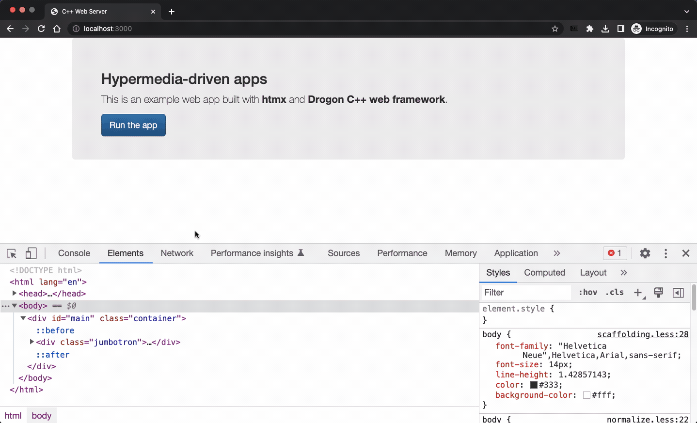
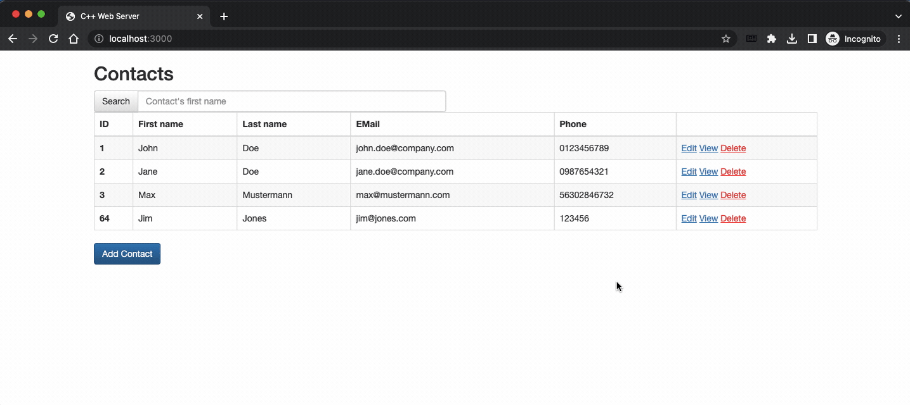
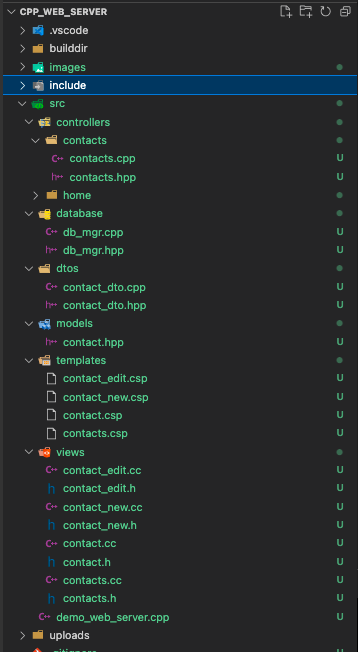
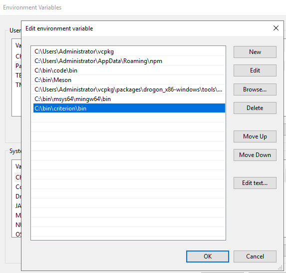
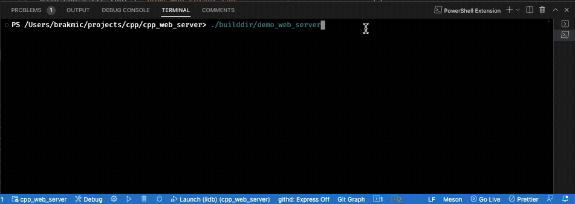

# Hypermedia-driven app built with **htmx** and **C++**



- [Hypermedia-driven app built with **htmx** and **C++**](#hypermedia-driven-app-built-with-htmx-and-c)
  - [Introduction](#introduction)
    - [Article](#article)
    - [htmx](#htmx)
    - [\_hyperscript](#_hyperscript)
    - [Why C++ for the backend?](#why-c-for-the-backend)
  - [Setup](#setup)
    - [Quick Start](#quick-start)
    - [Dependencies](#dependencies)
    - [macOS, Linux](#macos-linux)
    - [Windows — Compiler Choice](#windows--compiler-choice)
    - [Build System](#build-system)
  - [Docker](DOCKER.md)

## Quick Docker Start

```bash
docker build -t hda-with-cpp .
docker run -p 3000:3000 hda-with-cpp
```

Open <http://127.0.0.1:3000> in a browser. The image builds Drogon from source,
compiles the application, and runs the test suite. See [DOCKER.md](DOCKER.md) for
details on volume mounts, sample data import, and production configuration.

- [Application architecture](#application-architecture)
- [Project structure](#project-structure)
- [Tests](#tests)
- [Hypermedia-driven app](#hypermedia-driven-app)
  - [Program arguments](#program-arguments)
  - [Drogon configuration file](#drogon-configuration-file)
  - [Web Server configuration file](#web-server-configuration-file)
- [LICENSE](#license)

-----

## Introduction

This repository demonstrates a hypermedia-driven application using [htmx](https://htmx.org/) for the frontend and the [Drogon C++ framework](https://drogon.org/) for the backend. The goal is to build a responsive web application without relying on JavaScript frameworks.

The project is inspired by the book [Hypermedia Systems](https://hypermedia.systems/), which presents alternatives to the typical JavaScript-heavy approach. The authors focus on the original hypermedia architecture of the web, using HTML as the primary vehicle for application logic.

### Article

See [this article](https://blog.brakmic.com/writing-hdas-with-htmx-and-c/) for background and motivation for using htmx and C++ in this project.

### htmx

`htmx` extends HTML by enabling features such as AJAX requests, additional HTTP verbs, and declarative updates, all without custom JavaScript. For example, the following buttons handle navigation and form submission:

```html
<button hx-get="/contacts"
        hx-target="#main"
        hx-swap="innerHTML">
        Cancel
</button>
<button hx-post="/contacts//edit"
        hx-include="input"
        hx-target="#main"
        hx-swap="innerHTML">
 [Hypermedia-driven app built with **htmx** and **C++**](#hypermedia-driven-app-built-with-htmx-and-c)  
</button>
```

These controls:

- Execute AJAX requests
- Use HTTP verbs not natively available to `<button>`
- Pass additional element values
- Specify where and how to insert server response data

No custom JavaScript is required for this functionality.

### _hyperscript

The project also uses [_hyperscript](https://hyperscript.org/) for event handling and DOM manipulation directly in HTML. For example:

```html
<button id="edit-c" class="btn btn-primary"
      hx-get="/contacts//edit"
      hx-target="#main"
      hx-swap="innerHTML">Edit</button>
<button class="btn btn-danger"
      hx-delete="/contacts//delete"
      hx-confirm="Are you sure you wish to delete this contact?"
      hx-target="this"
      hx-swap="none"
      _="on click remove #edit-c
                  then remove me"
      >Delete</button>
<button class="btn btn-info"
      hx-get="/contacts"
      hx-target="#main"
      hx-swap="innerHTML">Back</button>

```

The second `<button>` uses _hyperscript to:

- React to click events
- Remove the control with `id=edit-c`
- Remove itself

After clicking, only the `Back` button remains.



The application uses HTML for client-server communication, not JSON. This approach preserves application semantics and reduces the need for complex JavaScript frameworks on the frontend.

### Why C++ for the backend?

The original backend example in the book is written in Python. This project uses C++ to demonstrate that htmx is language-agnostic and to provide a minimal backend without unnecessary dependencies.

## Setup

A C++20 compiler is required. GCC 12+, Clang 15+, or MSVC 19.34+ (VS 2022 17.4+)
all work. This project uses [vcpkg](https://vcpkg.io/) for dependency management and
[Meson](https://mesonbuild.com/) 1.4+ as the build system.

### Quick Start

1. Install vcpkg (if not already installed):

   ```bash
   git clone https://github.com/microsoft/vcpkg.git
   cd vcpkg && ./bootstrap-vcpkg.sh  # or .\bootstrap-vcpkg.bat on Windows
   ```

2. Install dependencies. On Windows use the `x64-windows-static-md` triplet
   (static libraries, dynamic CRT — avoids CRT mismatch with Meson):

   ```bash
   # Windows
   vcpkg install drogon[ctl] fmt argparse brotli zlib openssl sqlite3 soci[sqlite3] jsoncpp --triplet x64-windows-static-md --host-triplet x64-windows

   # macOS / Linux
   vcpkg install
   ```

3. Configure and build. On Windows, add `drogon_ctl` to PATH and point Meson
   at the vcpkg installed tree:

   ```bash
   # Windows (PowerShell)
   $env:PATH += ";<vcpkg_root>/installed/x64-windows-static-md/tools/drogon"
   meson setup builddir --vsenv `
     --cmake-prefix-path="<vcpkg_root>/installed/x64-windows-static-md" `
     --pkg-config-path="<vcpkg_root>/installed/x64-windows-static-md/lib/pkgconfig"

   # macOS / Linux
   meson setup builddir

   # Build
   meson compile -C builddir
   ```

4. Run tests (when Criterion is available):

   ```bash
   meson test -C builddir
   ```

5. Start the server from the build directory so Drogon finds
   static assets (vendor files, styles.css, index.html):

   ```bash
   cd builddir && ./demo_web_server
   ```

   Open <http://127.0.0.1:3000> in a browser.

### Dependencies

All dependencies are declared in `vcpkg.json` and installed automatically by
`vcpkg install`. The full list:

| Package   | Minimum Version | Purpose                             |
| --------- | --------------- | ----------------------------------- |
| drogon    | 1.9.0           | HTTP framework, routing, templates  |
| fmt       | 10.0            | String formatting                   |
| argparse  | 3.0             | CLI argument parsing                |
| soci      | 4.0             | C++ database access                 |
| sqlite3   | 3.40            | Embedded database                   |
| jsoncpp   | 1.9             | JSON config parsing                 |
| openssl   | 3.0             | TLS support                         |
| zlib      | —               | Compression                         |
| brotli    | —               | Compression                         |
| criterion | 2.4             | Unit test framework                 |

### macOS, Linux

Install build tools and Meson via your package manager:

```bash
# Ubuntu/Debian
sudo apt install build-essential meson ninja-build pkg-config

# macOS
brew install meson pkg-config
```

Then follow the Quick Start steps above. On Linux you can optionally install
dependencies from system packages (`apt install libdrogon-dev libcriterion-dev ...`)
instead of vcpkg.

### Windows — Compiler Choice

Both MSVC and MinGW work. Pick one:

**Path A: MSVC (recommended).** Install Visual Studio 2022 with the "Desktop
development with C++" workload. No MSYS, no pacman, no manual Drogon compilation.
`vcpkg install` handles everything.

**Path B: MinGW via MSYS2.** Install [MSYS2](https://www.msys2.org/). Open the
`MSYS2 MINGW64` shell. Set the vcpkg triplet before installing dependencies:

```bash
export VCPKG_DEFAULT_TRIPLET=x64-mingw-static
export VCPKG_DEFAULT_HOST_TRIPLET=x64-mingw-static
```

Then follow the same `vcpkg install` + `meson setup` + `meson compile` steps.
All packages including Drogon compile via vcpkg with the MinGW triplet.

### Build System

The project uses [Meson](https://mesonbuild.com/) 1.4+ with vcpkg manifest mode.
There are no hardcoded paths to edit. The build steps are:

```bash
# Install all dependencies (once)
vcpkg install

# Configure
meson setup builddir

# Build
meson compile -C builddir

# Run tests
meson test -C builddir
```

Docker builds are also supported. See [DOCKER.md](DOCKER.md) for instructions.

A C++20 compiler is required. GCC 12+, Clang 15+, or MSVC 19.34+ (VS 2022 17.4+)
all work. The `meson.build` file uses `dependency()` to discover libraries
installed by vcpkg or the system package manager. No manual path configuration
is needed.

## Application architecture

The frontend uses the **htmx** library and some `Bootstrap` resources for styling. There is no hand-written JavaScript running as **htmx** already provides the `responsive` stuff we expect any `modern` web app to offer.

The backend is based on the very fast C++ web framework called `Drogon`.

The database in use is SQLite3 but it can be replaced easily with any other SQL database. Simply adjust the `src/database/db_mgr.cpp` class. The library for accessing SQLite3 is [SOCI](https://soci.sourceforge.net/doc/release/4.0/) and it supports many other database backends. The root of this project contains a SQLite3 file, `demo.db`, that the app uses by default. There is also a CSV file available, `contacts.csv`, that contains a few entries that can be used to populate a new table.

## Project structure



- `controllers` contains classes that Drogon uses to map client calls to functions in the backend.
- `database` contains a small wrapper class for accessing the SQLite3 instance.
- `dtos` contains `Data Transfer Objects` that are used for data tansfers between frontend and backend.
- `templates` contains [CSPs](https://github.com/drogonframework/drogon-docs/blob/master/ENG-06-View.md) (C++ Server Pages), which are templates that `drogon_ctl` uses to generate C++ sources. These sources will be used to create HTML outputs.
- `views` contains Drogon-generated C++ classes. These files **should not be edited manually**. They will be replaced on every build. To change their behavior or contents, use CSPs from `templates` folder instead.

## Tests

Tests are done with the [Criterion](https://github.com/Snaipe/Criterion) library.

### macOS / Linux

Criterion can be installed via `brew install criterion`. Otherwise, you can manually build it as described [on this page](https://criterion.readthedocs.io/en/latest/setup.html#installation).

### Windows

To build Criterion with `Meson`, clone its repo first:

```bash
git clone --recursive https://github.com/Snaipe/Criterion.git
```

Then issue the following commands:

```powershell
cd Criterion
meson -Dprefix=c:/bin/criterion build
ninja -C build install
```

The installation directory prefix can be changed. After the installation is completed, set the path to Criterion's DLL file. This DLL will be used by test executables that have Criterion linked.



The test sources of this project are located in `test` and are being built automatically by `Meson`. To execute tests, you can use these two options:

```powershell
PS > meson test -C .\builddir\
ninja: no work to do.
ninja: Entering directory `.\builddir'
ninja: no work to do.
1/1 basic        OK              0.09s

Ok:                 1
Expected Fail:      0
Fail:               0
Unexpected Pass:    0
Skipped:            0
Timeout:            0

Full log written to .\builddir\meson-logs\testlog.txt
```

Or by directly calling the test executable itself:

```powershell
PS > .\builddir\test_demo_web_server.exe
[====] Synthesis: Tested: 1 | Passing: 1 | Failing: 0 | Crashing: 0
```

## Hypermedia-driven app

The web application starts by loading the `index.html` which contains a `div` tag with *id="main"*. Throughout the app, this tag will be used by other controls to dynamically replace its contents without any page refreshes. However, unlike other typical `modern` web apps, we use no JS frameworks like React or Angular to make the app responsive. Instead, we only use `htmx` as our scripting library.

Bootstrap and jQuery are included for styling and can be replaced or removed. They are not required for htmx or _hyperscript functionality.

The web app communicates with the server in a standard request-response fashion. But unlike so many other web apps out there, no JSON is being used. Instead, the server is only sending pieces of HTML code that the client uses to update the current state of the app.

### Program arguments

The server program accepts two parameters for setting the IP and Port.

```bash
Usage: demo_web_server [options]

Optional arguments:
-h --help               shows help message and exits [default: false]
-v --version            prints version information and exits [default: false]
-i --ip-address         Server IP Address [default: "127.0.0.1"]
-p --port               Port [default: 3000]
```



### Drogon configuration file

You can also use the included Drogon's `config.json` to control the behavior of the server. As Drogon offers [lots of options](https://github.com/drogonframework/drogon/blob/master/config.example.json), you should first [make yourself familiar with it](https://github.com/drogonframework/drogon-docs/blob/master/ENG/ENG-11-Configuration-File.md). The configuration file in this project contains only a few settings.

### Web Server configuration file

There also exist a separate JSON-based configuration file,`server_config.json`, that will be used by the web server. Currently, it only defines the location of the SQLite3 file, but it will be expanded in the future.

```json
{
  "database": {
    "type": "sqlite3",
    "file": "demo.db"
  }
}
```

This file should not be confused with Drogon's own JSON which is named `config.json`.

## LICENSE

[MIT](LICENSE)
